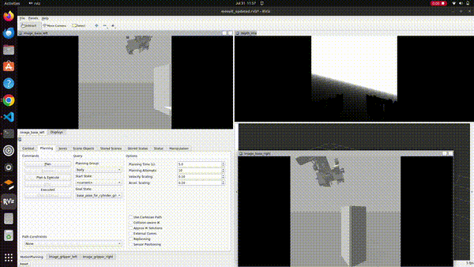

# 🤖 Robotic Arm Simulation Project

A complete robotic arm simulation environment using ROS Noetic, MoveIt, and Gazebo, packaged in Docker for easy deployment.

## 📋 Features

- **Complete ROS Noetic Environment**: Pre-configured with all necessary packages
- **MoveIt Motion Planning**: Advanced path planning and execution
- **Gazebo Simulation**: Realistic physics simulation
- **Docker Containerized**: Zero-setup deployment for team collaboration
- **GUI Support**: Full X11 forwarding for RViz, Gazebo, and other GUI applications
- **Persistent Container**: Maintains workspace state between sessions
- **CI/CD Pipeline**: Automated testing and deployment with GitHub Actions

## 🚀 Quick Start



*The robotic arm performing pick and place operations*

### Prerequisites

- Docker installed on your system
- X11 forwarding support (Linux/macOS with XQuartz)
- NVIDIA GPU drivers (optional, for GPU acceleration)

### Option 1: Using Pre-built Image (Fastest)

1. **Pull the latest image:**
   ```bash
   docker pull ak9685/robotic-arm-project:main
   ```

2. **Run directly:**
   ```bash
   docker run -it \
     --gpus all \
     --name robotic_arm_container \
     --env="DISPLAY=$DISPLAY" \
     --env="QT_X11_NO_MITSHM=1" \
     --volume="/tmp/.X11-unix:/tmp/.X11-unix:rw" \
     --net=host \
     --privileged \
     ak9685/robotic-arm-project:main
   ```

### Option 2: Using the Launch Script (Recommended for Development)

1. **Clone the repository:**
   ```bash
   git clone https://github.com/Team-Deimos-IIT-Mandi/Robotic_Arm
   cd Robotic_Arm
   ```

2. **Make the launch script executable:**
   ```bash
   chmod +x launch_container.sh
   ```

3. **Launch the container:**
   ```bash
   ./launch_container.sh
   ```

### Option 3: Using Docker Compose

1. **Setup X11 forwarding:**
   ```bash
   export XAUTH=/tmp/.docker.xauth
   touch $XAUTH
   xauth nxlist $DISPLAY | sed -e 's/^..../ffff/' | xauth -f $XAUTH nxmerge -
   xhost +local:docker
   ```

2. **Launch with Docker Compose:**
   ```bash
   docker-compose up -d
   docker-compose exec robotic_arm /bin/bash
   ```

### Option 4: Build from Source

1. **Build the image:**
   ```bash
   docker build -t robotic_arm:latest .
   ```

2. **Run the container:**
   ```bash
   docker run -it \
     --gpus all \
     --name robotic_arm_container \
     --env="DISPLAY=$DISPLAY" \
     --env="QT_X11_NO_MITSHM=1" \
     --volume="/tmp/.X11-unix:/tmp/.X11-unix:rw" \
     --net=host \
     --privileged \
     robotic_arm:latest
   ```

## 🎮 Usage

Once inside the container, you can run various commands:

### Launch Full Simulation
```bash
# Launch complete environment (Gazebo + MoveIt + RViz)
roslaunch roslaunch arm_moveit_config final_arm_launch.launch
```

### Launch Individual Components
```bash
# Launch only MoveIt with RViz
roslaunch arm_moveit_config demo.launch

# Launch only Gazebo simulation
roslaunch robotic_arm gazebo.launch

# Launch MoveIt move_group node
roslaunch arm_moveit_config move_group.launch
```

### Debug Commands
```bash
# Check available controller types
rosservice call controller_manager/list_controller_types

# Monitor joint states
rostopic echo /joint_states

# List active controllers
rosservice call controller_manager/list_controllers

# Check ROS package path
echo $ROS_PACKAGE_PATH

# List all ROS packages
rospack list
```

## 📁 Project Structure

```
Robotic_Arm/
├── .github/
│   └── workflows/
│       └── main.yml           # CI/CD pipeline
├── Dockerfile                 # Main container definition
├── docker-compose.yml         # Docker Compose configuration
├── launch_container.sh        # Enhanced launch script
├── README.md                  # This file
├── .dockerignore              # Docker ignore patterns
├── src/                       # ROS packages source code
│   ├── Arm_Urdf/              # Robot URDF and configurations
│   ├── arm_moveit_config/     # MoveIt configuration
│   └── teleop_arm/            # Teleoperation package
└── videos/
    └── working.gif            # Demo video
```

## 🔧 Configuration Files

### Key Configuration Files:
- `src/Arm_Urdf/config/joint_trajectory_control.yaml` - Controller configuration
- `src/arm_moveit_config/config/controllers.yaml` - MoveIt controller settings
- `src/arm_moveit_config/launch/move_group.launch` - MoveIt launch file

### Controller Configuration:
The project uses `position_controllers/JointTrajectoryController` for both:
- **Body Controller**: Controls main arm joints (Joint_1 to Joint_6)
- **End Effector Controller**: Controls gripper fingers (Finger_1, Finger_2)

## 🚀 CI/CD Pipeline

This project includes automated testing and deployment:

- **Continuous Integration**: Every push triggers automated builds and tests
- **Docker Hub Deployment**: Successful builds on `main` branch are automatically pushed to Docker Hub
- **Multi-stage Testing**: Container functionality is verified before deployment

### Build Status


### Using Latest Stable Image
```bash
# Always get the latest tested version
docker pull ak9685/robotic-arm-project:main
```

## 🐛 Troubleshooting

### Common Issues:

1. **GUI Applications Not Displaying:**
   ```bash
   # Ensure X11 forwarding is set up
   xhost +local:docker
   export DISPLAY=:0
   ```

2. **Controller Loading Failures:**
   ```bash
   # Check available controller types
   rosservice call controller_manager/list_controller_types
   
   # Verify controller configuration
   rosparam list | grep controller
   ```

3. **Trajectory Execution Failures:**
   - Check joint state synchronization
   - Verify controller tolerances in YAML files
   - Ensure proper timing parameters

4. **Container Build Failures:**
   ```bash
   # Clean build with no cache
   docker build --no-cache -t robotic_arm:latest .
   
   # Or pull the pre-built image
   docker pull ak9685/robotic-arm-project:main
   ```

5. **Package Not Found Errors:**
   ```bash
   # Check if packages are properly built
   source /opt/ros/noetic/setup.bash
   source /root/ros_ws/devel/setup.bash
   rospack list | grep -i arm
   ```

### Launch Script Options:

```bash
./launch_container.sh --help     # Show help
./launch_container.sh --rebuild  # Rebuild image and container
./launch_container.sh --fresh    # Create fresh container
```


### 🤖 Teleoperation with Stereo Vision

This project enables teleoperation of a robotic arm using stereo vision for object detection and a virtual controller for manual control.

---

#### 🧠 Components

##### 1. **Red Cylinder Detection + Autonomous Arm Movement**

```bash
rosrun teleop_arm cylinder_primitive_final.py
```

* Detects a red cylindrical object using stereo camera input.
* Calculates the **(x, y, z)** coordinates of the object.
* Moves the robotic arm incrementally toward the detected position.
* Object detection is implemented using **OpenCV**. You can easily swap it with other models like **YOLO**, **MediaPipe**, or any preferred detector.

##### 2. **Virtual Teleoperation Controller**

```bash
rosrun teleop_arm teleop_controller_final.py
```

* Launches a **Tkinter-based GUI** for manual control.
* Allows interactive movement of the robotic arm using on-screen buttons.

---

### ⚠️ Note

The **stereo vision package** was used **only for testing purposes**.
It is **not required** during actual teleoperation and does not affect arm control.

---


## 🔄 Development Workflow

### For Contributors:
1. **Fork** the repository
2. **Create a branch** for your feature
3. **Make changes** to your code
4. **Test locally** using the Docker environment
5. **Push changes** - CI/CD will automatically test your changes
6. **Submit a pull request**

### For Users:
1. **Pull latest changes**: `git pull origin main`
2. **Use pre-built image**: `docker pull ak9685/robotic-arm-project:main`
3. **Or rebuild locally**: `./launch_container.sh --rebuild`

## 📦 What's Included

### Pre-installed Packages:
- ROS Noetic Desktop Full
- MoveIt Motion Planning Framework  
- Gazebo Robot Simulator
- All trajectory and position controllers
- RViz visualization tools
- Joint state publishers
- TF2 transformation library
- Xacro XML processing tools

### Ready-to-Use Features:
- ✅ Robotic arm URDF model
- ✅ MoveIt configuration
- ✅ Gazebo simulation world
- ✅ Controller configurations
- ✅ Launch files for all scenarios
- ✅ GUI applications support
- ✅ Automated testing pipeline
- ✅ Docker Hub integration

## 👥 Team Collaboration

Your teammates can get started in multiple ways:

### Option 1: Quick Start (No Build Required)
```bash
docker pull ak9685/robotic-arm-project:main
docker run -it --gpus all --name robotic_arm --env="DISPLAY=$DISPLAY" --volume="/tmp/.X11-unix:/tmp/.X11-unix:rw" --net=host --privileged ak9685/robotic-arm-project:main
```

### Option 2: Development Setup
1. **Clone** the repository
2. **Run** `./launch_container.sh`
3. **Start developing** immediately!

No need to:
- Install ROS
- Configure MoveIt
- Set up Gazebo
- Install dependencies
- Debug package conflicts

## 🤝 Contributing

1. Fork the repository
2. Create a feature branch (`git checkout -b feature/amazing-feature`)
3. Make your changes
4. Test in the Docker environment
5. Commit your changes (`git commit -m 'Add amazing feature'`)
6. Push to the branch (`git push origin feature/amazing-feature`)
7. Open a Pull Request

The CI/CD pipeline will automatically test your changes!

## 📈 Project Status

- ✅ **Active Development**: Regular updates and improvements
- ✅ **Automated Testing**: Every commit is tested
- ✅ **Docker Hub**: Latest stable versions available
- ✅ **Documentation**: Comprehensive setup and usage guides

## 📞 Support

For issues and questions:
- 🐛 **Bug Reports**: [Open an issue](https://github.com/Team-Deimos-IIT-Mandi/Robotic_Arm/issues)
- 💡 **Feature Requests**: [Start a discussion](https://github.com/Team-Deimos-IIT-Mandi/Robotic_Arm/discussions)
- 📖 **Documentation**: Check this README and inline code comments
- 🤝 **Community**: Join our project discussions

## 📜 License

This project is licensed under the MIT License - see the [LICENSE](LICENSE) file for details.

---

**Happy Robotics! 🤖✨**

*Built with ❤️ by Team Deimos, IIT Mandi*
